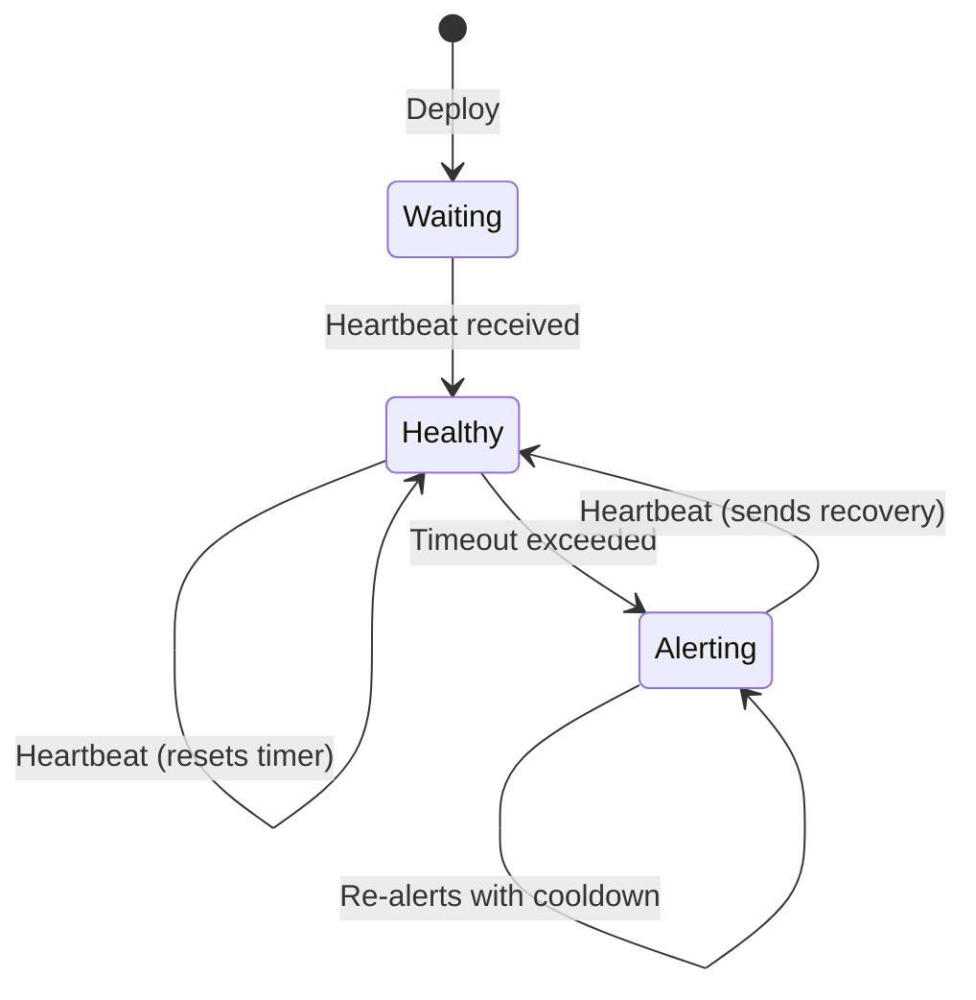

# Deadman

A dead man's switch for Prometheus/Alertmanager on Cloudflare Workers.

[](https://deploy.workers.cloudflare.com/?url=https://github.com/briansunter/deadman)

If Prometheus or Alertmanager goes down, it can't tell you. Deadman watches for Watchdog heartbeats and alerts you through Discord, Slack, Telegram, or Email when they stop.

## How It Works



1. Prometheus fires a `Watchdog` alert every minute via Alertmanager
2. Alertmanager POSTs to Deadman's webhook endpoint
3. A Durable Object records the timestamp and schedules an alarm
4. If no heartbeat arrives before timeout (default 5 min), notifications fire
5. When heartbeats resume, a recovery notification is sent

## Quick Start

```bash
git clone https://github.com/briansunter/deadman.git && cd deadman
bun install && bun run deploy

# Set secrets
wrangler secret put AUTH_TOKEN           # generate: openssl rand -hex 32
wrangler secret put DISCORD_WEBHOOK_URL  # or another channel below
```

Or use the **Deploy to Cloudflare** button above, then add secrets in the dashboard.

### Verify

```bash
# Health check (no auth)
curl https://deadman.YOUR_SUBDOMAIN.workers.dev/health

# Send a test heartbeat
curl -X POST https://deadman.YOUR_SUBDOMAIN.workers.dev/webhook/alertmanager \
  -H "Authorization: Bearer $AUTH_TOKEN" \
  -H "Content-Type: application/json" \
  -d '{"alerts":[{"status":"firing","labels":{"alertname":"Watchdog"}}]}'

# Check status
curl https://deadman.YOUR_SUBDOMAIN.workers.dev/status \
  -H "Authorization: Bearer $AUTH_TOKEN"
```

## Configuration

### Secrets (via `wrangler secret put`)

| Secret | Required | Description |
|---|---|---|
| `AUTH_TOKEN` | **Yes** | Bearer token for all endpoints except `/health` |
| `DISCORD_WEBHOOK_URL` | No | Discord channel webhook |
| `SLACK_WEBHOOK_URL` | No | Slack incoming webhook |
| `TELEGRAM_BOT_TOKEN` | No | Telegram bot token (requires `TELEGRAM_CHAT_ID`) |
| `TELEGRAM_CHAT_ID` | No | Telegram chat ID (requires `TELEGRAM_BOT_TOKEN`) |

At least one notification channel must be configured.

### Environment Variables (in `wrangler.toml [vars]`)

| Variable | Default | Description |
|---|---|---|
| `HEARTBEAT_TIMEOUT_SECONDS` | `300` (5 min) | Seconds before alerting |
| `ALERT_COOLDOWN_SECONDS` | `900` (15 min) | Seconds between repeated alerts |
| `EMAIL_FROM` / `EMAIL_TO` | — | Cloudflare Email Routing addresses |
| `ALERT_TITLE` | `Deadman Switch - ALERTING SYSTEM DOWN` | Custom alert title |
| `ALERT_MESSAGE` | *(default template)* | Custom alert body |
| `RECOVERY_TITLE` | `Deadman Switch - RECOVERED` | Custom recovery title |
| `RECOVERY_MESSAGE` | *(default template)* | Custom recovery body |

Message templates support placeholders: `{elapsed_minutes}`, `{source}`, `{last_heartbeat}`, `{checked_at}`.

## Alertmanager Setup

```yaml
receivers:
  - name: deadman
    webhook_configs:
      - url: https://deadman.YOUR_SUBDOMAIN.workers.dev/webhook/alertmanager
        http_config:
          authorization:
            type: Bearer
            credentials: "<your-auth-token>"
        send_resolved: false

route:
  routes:
    - match:
        alertname: Watchdog
      receiver: deadman
      group_wait: 0s
      group_interval: 1m
      repeat_interval: 1m
```

Only `Watchdog`, `DeadMansSwitch`, and `InfoInhibitor` alerts with `status: "firing"` trigger a heartbeat. All other alerts are ignored.

See [alertmanager-config.example.yaml](./alertmanager-config.example.yaml) for a full kube-prometheus-stack example.

## API

All endpoints except `/health` require `Authorization: Bearer <token>`.

| Endpoint | Method | Description |
|---|---|---|
| `/health` | GET | Liveness check (no auth) |
| `/status` | GET | Current heartbeat state |
| `/webhook/alertmanager` | POST | Alertmanager webhook receiver |
| `/ping?source=<name>` | GET | Manual heartbeat |
| `/reset` | POST | Clear state, return to waiting |

## Development

```bash
cp .dev.vars.example .dev.vars  # add test credentials
bun run dev                     # local dev server
bun run test                    # run tests
bun run typecheck               # type check
```

## License

MIT
