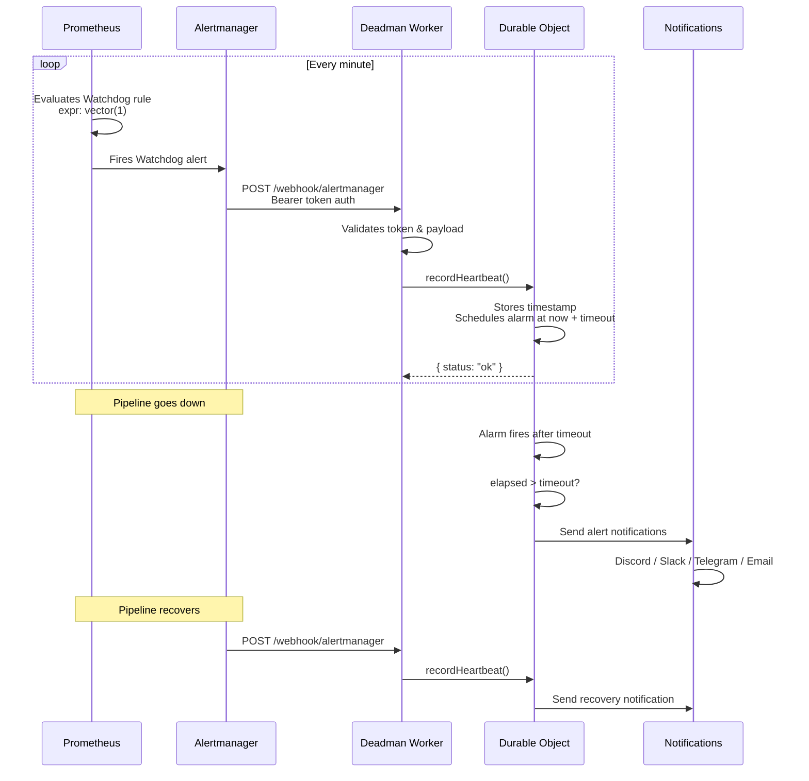
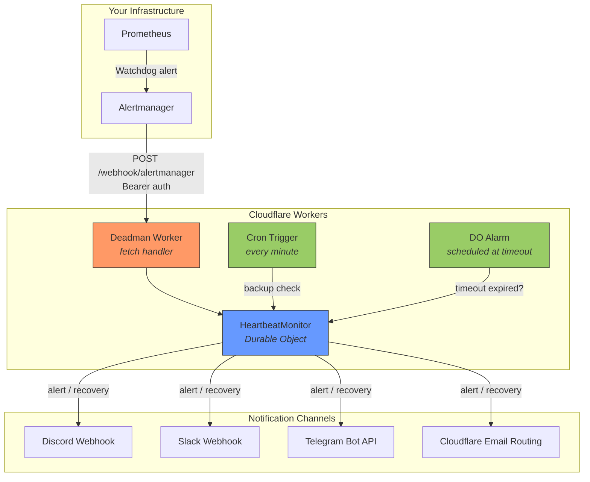
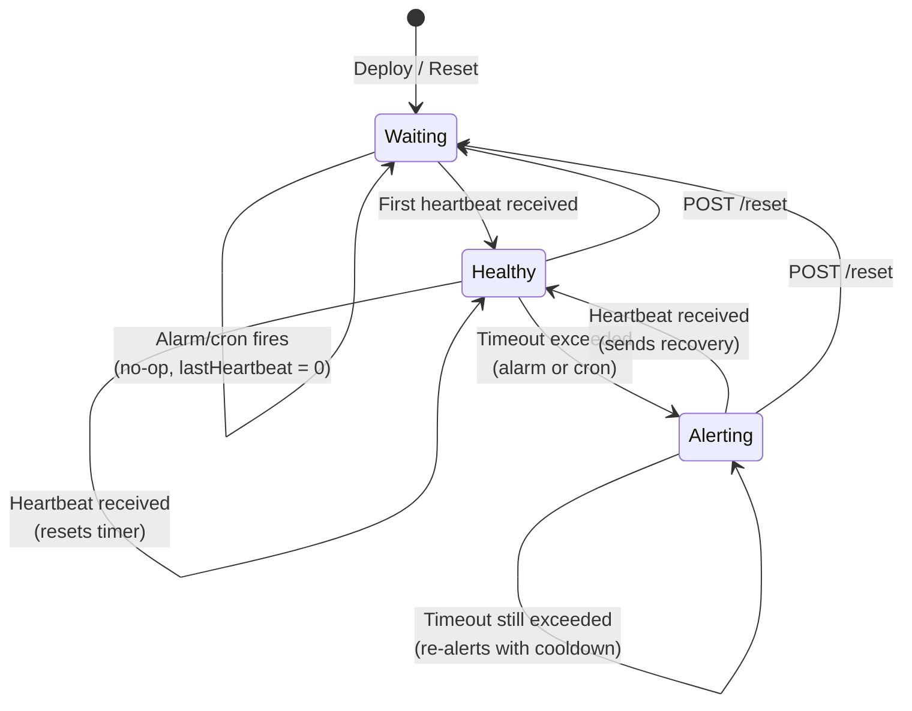

# Deadman

A dead man's switch for your Prometheus/Alertmanager stack, running on Cloudflare Workers.

[](https://deploy.workers.cloudflare.com/?url=https://github.com/briansunter/deadman)

If Prometheus or Alertmanager goes down, it can't tell you it's down. Deadman runs on completely separate infrastructure (Cloudflare Workers), watches for periodic heartbeats from your alerting pipeline, and notifies you through independent channels (Discord, Slack, Telegram, Email) when heartbeats stop arriving.

---

## How It Works



## Architecture



### State Machine



| State | Condition | Behavior |
|---|---|---|
| **Waiting** | No heartbeat ever received | No alerts fire. Safe initial state after deploy. |
| **Healthy** | Last heartbeat within timeout window | Timer resets on each heartbeat. |
| **Alerting** | Timeout exceeded without heartbeat | Sends notifications, respects cooldown between repeats. |

### Redundant Timeout Detection

Deadman uses two independent mechanisms to detect missed heartbeats:

1. **Durable Object Alarms** (primary) - Scheduled at `now + timeout` on each heartbeat. Precise and efficient.
2. **Cron Trigger** (backup) - Runs every minute. Catches edge cases where an alarm might not fire (e.g., DO eviction).

Both check the same state - if the elapsed time since the last heartbeat exceeds the configured timeout, an alert is triggered.

---

## Quick Start

### Option 1: One-Click Deploy

Click the button below, then configure secrets in the Cloudflare dashboard:

[](https://deploy.workers.cloudflare.com/?url=https://github.com/briansunter/deadman)

After deploy:
1. Go to **Workers & Pages > deadman > Settings > Variables and Secrets**
2. Add `AUTH_TOKEN` (generate with `openssl rand -hex 32`)
3. Add at least one notification channel (e.g., `DISCORD_WEBHOOK_URL`)
4. Configure Alertmanager to send Watchdog alerts to your worker

### Option 2: Deploy with Wrangler

```bash
# Clone and install
git clone https://github.com/briansunter/deadman.git
cd deadman
bun install

# Deploy
bun run deploy

# Set secrets
wrangler secret put AUTH_TOKEN
wrangler secret put DISCORD_WEBHOOK_URL  # or other channel
```

### Verify It Works

```bash
# Generate a token
AUTH_TOKEN=$(openssl rand -hex 32)

# Health check (no auth required)
curl https://deadman.YOUR_SUBDOMAIN.workers.dev/health
# → ok

# Check status (requires auth)
curl https://deadman.YOUR_SUBDOMAIN.workers.dev/status \
  -H "Authorization: Bearer $AUTH_TOKEN"
# → {"status":"waiting","lastHeartbeat":null,...}

# Send a test heartbeat
curl -X POST https://deadman.YOUR_SUBDOMAIN.workers.dev/webhook/alertmanager \
  -H "Authorization: Bearer $AUTH_TOKEN" \
  -H "Content-Type: application/json" \
  -d '{
    "alerts": [{
      "status": "firing",
      "labels": {"alertname": "Watchdog"}
    }]
  }'
# → {"status":"ok","lastHeartbeat":1741...}

# Check status again
curl https://deadman.YOUR_SUBDOMAIN.workers.dev/status \
  -H "Authorization: Bearer $AUTH_TOKEN"
# → {"status":"healthy","lastHeartbeat":"2026-03-12T...","elapsedSeconds":5,...}
```

---

## Configuration

### Secrets

Set via `wrangler secret put <NAME>` or the Cloudflare dashboard.

| Secret | Required | Description |
|---|---|---|
| `AUTH_TOKEN` | **Yes** | Bearer token for all endpoints except `/health`. Generate with `openssl rand -hex 32`. |
| `DISCORD_WEBHOOK_URL` | No | Discord channel webhook URL |
| `SLACK_WEBHOOK_URL` | No | Slack incoming webhook URL |
| `TELEGRAM_BOT_TOKEN` | No | Telegram bot token (must be set with `TELEGRAM_CHAT_ID`) |
| `TELEGRAM_CHAT_ID` | No | Telegram chat/group ID (must be set with `TELEGRAM_BOT_TOKEN`) |

At least one complete notification channel is required. The worker returns `500 Service misconfigured` until this is satisfied.

### Environment Variables

Set in `wrangler.toml` under `[vars]` or in the Cloudflare dashboard.

| Variable | Default | Description |
|---|---|---|
| `HEARTBEAT_TIMEOUT_SECONDS` | `300` (5 min) | Seconds without a heartbeat before alerting |
| `ALERT_COOLDOWN_SECONDS` | `900` (15 min) | Minimum seconds between repeated alert notifications |
| `EMAIL_FROM` | — | Sender address for Cloudflare Email Routing |
| `EMAIL_TO` | — | Recipient address for Cloudflare Email Routing |

### Notification Channels

| Channel | Required Config | Notes |
|---|---|---|
| **Discord** | `DISCORD_WEBHOOK_URL` | Simplest setup. Uses embeds with color-coded severity. |
| **Slack** | `SLACK_WEBHOOK_URL` | Uses incoming webhook with emoji indicators. |
| **Telegram** | `TELEGRAM_BOT_TOKEN` + `TELEGRAM_CHAT_ID` | Both must be set. Uses MarkdownV2 formatting. |
| **Email** | `EMAIL_FROM` + `EMAIL_TO` + `EMAIL` binding | Requires Cloudflare Email Routing enabled on your domain. |

Partially configured channels (e.g., `TELEGRAM_BOT_TOKEN` without `TELEGRAM_CHAT_ID`) cause a startup error. This is intentional - silent misconfiguration is worse than a hard failure for a monitoring service.

All configured channels are notified in parallel. If at least one succeeds, the alert is considered delivered. If all fail, the next alarm cycle retries.

### Tuning Timeouts

```mermaid
gantt
    title Timeline: Heartbeat → Alert → Recovery
    dateFormat X
    axisFormat %s

    section Heartbeats
    Heartbeat 1           :h1, 0, 1
    Heartbeat 2           :h2, 60, 1
    Heartbeat 3           :h3, 120, 1
    Last heartbeat        :h4, 180, 1

    section Pipeline Down
    No heartbeats         :crit, 181, 480

    section Detection
    Timeout window (300s) :active, 180, 480
    ALERT fires           :milestone, 480, 0

    section Recovery
    Heartbeat resumes     :done, 600, 1
    Recovery notification :milestone, 600, 0
```



**Recommended settings by use case:**

| Scenario | `HEARTBEAT_TIMEOUT_SECONDS` | `ALERT_COOLDOWN_SECONDS` | Alertmanager `repeat_interval` |
|---|---|---|---|
| Fast detection (dev/staging) | `120` (2 min) | `300` (5 min) | `30s` |
| Standard (production) | `300` (5 min) | `900` (15 min) | `1m` |
| Relaxed (low-priority) | `600` (10 min) | `3600` (1 hr) | `2m` |

The `repeat_interval` in Alertmanager controls how often heartbeats are sent. It should be significantly shorter than `HEARTBEAT_TIMEOUT_SECONDS` so that a few missed heartbeats don't trigger a false alert.

---

## Alertmanager Setup

### Minimal Configuration

```yaml
receivers:
  - name: deadman
    webhook_configs:
      - url: https://deadman.YOUR_SUBDOMAIN.workers.dev/webhook/alertmanager
        http_config:
          authorization:
            type: Bearer
            credentials: "<your-auth-token>"
        send_resolved: false

route:
  routes:
    - match:
        alertname: Watchdog
      receiver: deadman
      group_wait: 0s
      group_interval: 1m
      repeat_interval: 1m
```

### Full Example (kube-prometheus-stack)

See [alertmanager-config.example.yaml](./alertmanager-config.example.yaml) for a complete example, or use this with kube-prometheus-stack Helm values:

```yaml
# values.yaml for kube-prometheus-stack
alertmanager:
  config:
    route:
      receiver: "default"
      group_by: ["alertname", "namespace"]
      group_wait: 30s
      group_interval: 5m
      repeat_interval: 12h
      routes:
        # Route Watchdog and related alerts to deadman
        - matchers:
            - alertname =~ "Watchdog|DeadMansSwitch|InfoInhibitor"
          receiver: "deadman"
          group_wait: 0s
          group_interval: 1m
          repeat_interval: 1m
          continue: false

        # Your other routes here...

    receivers:
      - name: "default"
        # Your default receiver config...

      - name: "deadman"
        webhook_configs:
          - url: "https://deadman.YOUR_SUBDOMAIN.workers.dev/webhook/alertmanager"
            http_config:
              authorization:
                type: Bearer
                credentials: "<your-auth-token>"
            send_resolved: false
```

### Which Alerts Trigger a Heartbeat?

Deadman only refreshes the heartbeat for these specific alert names when they are `firing`:

- `Watchdog` - Standard Prometheus dead man's switch alert
- `DeadMansSwitch` - Alternative name used by some configurations
- `InfoInhibitor` - Informational alert from kube-prometheus-stack

All other alerts are ignored and return `{"status":"ignored","reason":"no watchdog alert firing"}`. This prevents a partially broken alerting pipeline from masking issues.

---

## API Reference

All endpoints except `/health` require `Authorization: Bearer <token>`.

### `GET /health`

Liveness check. No authentication required.

```
200 ok
```

### `GET /status`

Returns current heartbeat state. Use this for external monitoring dashboards.

```json
{
  "status": "healthy",
  "lastHeartbeat": "2026-03-12T12:00:00.000Z",
  "elapsedSeconds": 45,
  "timeoutSeconds": 300,
  "isAlerting": false,
  "source": "alertmanager:Watchdog"
}
```

| Field | Type | Description |
|---|---|---|
| `status` | `"waiting" \| "healthy" \| "alerting"` | Computed from elapsed time vs timeout |
| `lastHeartbeat` | `string \| null` | ISO 8601 timestamp of last heartbeat |
| `elapsedSeconds` | `number \| null` | Seconds since last heartbeat |
| `timeoutSeconds` | `number` | Configured timeout threshold |
| `isAlerting` | `boolean` | Whether an alert notification has been sent |
| `source` | `string` | Source of last heartbeat (e.g., `alertmanager:Watchdog`) |

### `POST /webhook/alertmanager`

Receives Alertmanager webhook payloads. Only `Watchdog`, `DeadMansSwitch`, and `InfoInhibitor` alerts with `status: "firing"` refresh the heartbeat.

**Request body:**

```json
{
  "alerts": [
    {
      "status": "firing",
      "labels": {
        "alertname": "Watchdog"
      }
    }
  ]
}
```

**Responses:**

```json
// Heartbeat recorded
{"status":"ok","lastHeartbeat":1741785600000}

// Alert ignored (not a watchdog alert)
{"status":"ignored","reason":"no watchdog alert firing"}

// Invalid payload
{"error":"Invalid payload","issues":[...]}
```

### `GET /ping?source=<name>`

Records a manual heartbeat. Useful for testing or custom integrations that don't use Alertmanager.

```json
{"status":"ok","lastHeartbeat":1741785600000}
```

### `POST /reset`

Clears all state back to the initial "waiting for first heartbeat" mode. Cancels any pending alarms.

```json
{"status":"reset","message":"Waiting for first heartbeat"}
```

### Error Responses

| Status | Meaning |
|---|---|
| `401` | Missing or invalid bearer token |
| `405` | Wrong HTTP method for this endpoint |
| `500` | Configuration error (missing secrets or notification channel) |

---

## Local Development

```bash
# Set up local environment
cp .dev.vars.example .dev.vars
# Edit .dev.vars with your test credentials

# Generate Cloudflare types
bun run cf-typegen

# Start local dev server
bun run dev
```

### Testing Locally

```bash
TOKEN="change-me-to-a-secure-random-token"  # from .dev.vars

# Send a heartbeat
curl -X POST http://localhost:8787/webhook/alertmanager \
  -H "Authorization: Bearer $TOKEN" \
  -H "Content-Type: application/json" \
  -d '{
    "alerts": [{
      "status": "firing",
      "labels": {"alertname": "Watchdog"}
    }]
  }'

# Check status
curl http://localhost:8787/status \
  -H "Authorization: Bearer $TOKEN"

# Send a manual ping
curl "http://localhost:8787/ping?source=manual-test" \
  -H "Authorization: Bearer $TOKEN"

# Reset state
curl -X POST http://localhost:8787/reset \
  -H "Authorization: Bearer $TOKEN"
```

### Development Commands

```bash
bun install          # Install dependencies
bun run dev          # Local development server (wrangler dev)
bun run deploy       # Deploy to Cloudflare Workers
bun run typecheck    # TypeScript type checking
bun run test         # Run tests
bun run cf-typegen   # Regenerate Cloudflare runtime types
bun run tail         # Stream logs from deployed worker
```

---

## Project Structure

```
deadman/
├── src/
│   ├── index.ts              # Worker fetch handler, routes, cron trigger
│   ├── heartbeat-monitor.ts  # Durable Object - state machine & alarm logic
│   ├── notify.ts             # Multi-channel notification dispatcher
│   ├── auth.ts               # HMAC-based timing-safe token verification
│   ├── config.ts             # Runtime config validation & parsing
│   └── types.ts              # Env interface, Zod schemas, HeartbeatState
├── wrangler.toml             # Cloudflare Worker configuration
├── alertmanager-config.example.yaml
├── .dev.vars.example         # Local development secrets template
└── package.json
```

---

## Security

- **Bearer token authentication** on all operational endpoints (timing-safe HMAC comparison).
- **No query-string auth** - tokens are never exposed in URLs or server logs.
- **Selective heartbeat acceptance** - only dedicated watchdog alerts refresh the heartbeat. A partially broken pipeline sending regular alerts cannot mask an outage.
- **Notification delivery verification** - alert state is only persisted after at least one channel delivers successfully. If all channels fail, the next cycle retries.
- **Input validation** - all webhook payloads are validated with Zod schemas.

## Operations Notes

- `/health` is a process-level liveness check only. It does **not** tell you whether heartbeats are arriving.
- `/status` shows the real heartbeat state. Use this for monitoring dashboards or external health checks.
- On first deploy, Deadman starts in `waiting` state and will not alert until it receives its first heartbeat. This prevents false alerts during initial setup.
- Use `POST /reset` if you need to return to the `waiting` state (e.g., during maintenance).
- A `401` means the bearer token is missing or wrong.
- A `500` usually means runtime configuration is incomplete (missing notification channel, partial Telegram config, etc.).
- Recovery notifications are only sent after Deadman has entered the alerting state, not on every heartbeat.

## License

MIT
