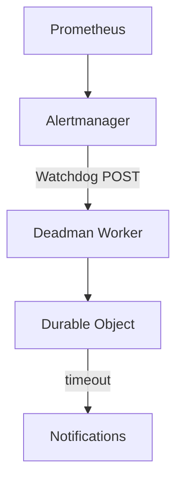

# Deadman

A dead man's switch for Prometheus/Alertmanager on Cloudflare Workers + Durable Objects.

[](https://deploy.workers.cloudflare.com/?url=https://github.com/briansunter/deadman)

Prometheus can't alert you if it's down. Deadman runs on independent infrastructure, expects periodic [Watchdog](https://runbooks.prometheus-operator.dev/runbooks/general/watchdog/) heartbeats from Alertmanager, and notifies you when they stop arriving.

## How It Works



- Alertmanager sends Watchdog alerts to Deadman every minute
- Each heartbeat resets a timeout (default 5 min)
- If the timeout expires, Deadman alerts through all configured channels
- When heartbeats resume, a recovery notification is sent

## Quick Start

```bash
git clone https://github.com/briansunter/deadman.git && cd deadman
bun install && bun run deploy

wrangler secret put AUTH_TOKEN           # generate: openssl rand -hex 32
wrangler secret put DISCORD_WEBHOOK_URL  # or another channel
```

Or click **Deploy to Cloudflare** above, then add secrets in the dashboard.

Test it:

```bash
# Send a heartbeat
curl -X POST https://deadman.YOUR_SUBDOMAIN.workers.dev/webhook/alertmanager \
  -H "Authorization: Bearer $AUTH_TOKEN" \
  -H "Content-Type: application/json" \
  -d '{"alerts":[{"status":"firing","labels":{"alertname":"Watchdog"}}]}'

# Check status
curl -H "Authorization: Bearer $AUTH_TOKEN" \
  https://deadman.YOUR_SUBDOMAIN.workers.dev/status
```

## Alertmanager Setup

```yaml
receivers:
  - name: deadman
    webhook_configs:
      - url: https://deadman.YOUR_SUBDOMAIN.workers.dev/webhook/alertmanager
        http_config:
          authorization:
            type: Bearer
            credentials: "<your-auth-token>"
        send_resolved: false

route:
  routes:
    - match:
        alertname: Watchdog
      receiver: deadman
      group_wait: 0s
      group_interval: 1m
      repeat_interval: 1m
```

Only `Watchdog`, `DeadMansSwitch`, and `InfoInhibitor` alerts trigger a heartbeat. Everything else is ignored.

See [alertmanager-config.example.yaml](./alertmanager-config.example.yaml) for a kube-prometheus-stack example.

## Configuration

### Secrets (`wrangler secret put`)

| Secret | Required | Description |
|---|---|---|
| `AUTH_TOKEN` | **Yes** | Bearer token for all endpoints except `/health` |
| `DISCORD_WEBHOOK_URL` | No | Discord channel webhook |
| `SLACK_WEBHOOK_URL` | No | Slack incoming webhook |
| `TELEGRAM_BOT_TOKEN` | No | Requires `TELEGRAM_CHAT_ID` |
| `TELEGRAM_CHAT_ID` | No | Requires `TELEGRAM_BOT_TOKEN` |

At least one notification channel must be configured.

### Environment Variables (`wrangler.toml [vars]`)

| Variable | Default | Description |
|---|---|---|
| `HEARTBEAT_TIMEOUT_SECONDS` | `300` (5 min) | How long without a heartbeat before alerting |
| `ALERT_COOLDOWN_SECONDS` | `900` (15 min) | Minimum interval between repeated alerts |
| `EMAIL_FROM` / `EMAIL_TO` | — | Cloudflare Email Routing addresses |

### Custom Alert Messages

Override default notification text with template variables:

| Variable | Default |
|---|---|
| `ALERT_TITLE` | `Deadman Switch - ALERTING SYSTEM DOWN` |
| `ALERT_MESSAGE` | *(detailed alert with timestamps)* |
| `RECOVERY_TITLE` | `Deadman Switch - RECOVERED` |
| `RECOVERY_MESSAGE` | *(recovery confirmation)* |

Placeholders: `{elapsed_minutes}`, `{source}`, `{last_heartbeat}`, `{checked_at}`

## API

All endpoints except `/health` require `Authorization: Bearer <token>`.

| Endpoint | Method | Description |
|---|---|---|
| `/health` | GET | Liveness check (no auth) |
| `/status` | GET | Current heartbeat state |
| `/webhook/alertmanager` | POST | Alertmanager webhook receiver |
| `/ping?source=<name>` | GET | Manual heartbeat for testing |
| `/reset` | POST | Clear state, return to waiting |

## Development

```bash
cp .dev.vars.example .dev.vars
bun run dev          # local dev server
bun run test         # run tests
bun run typecheck    # type check
bun run deploy       # deploy to Cloudflare
```

## License

MIT
